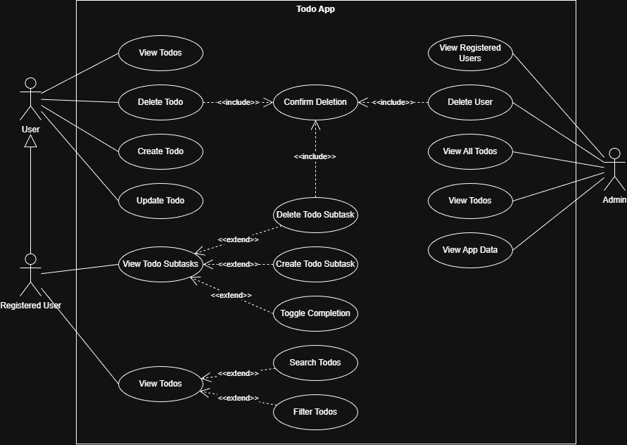

# Todo Application with Subtasks

A full-stack web application for managing tasks with hierarchical subtask support. Built with Spring Boot, React, and MySQL.


---

## Vision


---

## Use Case Diagram

The following diagram illustrates all the interactions users can have with the Todo application:



### Actors

#### User (Guest):

- Basic todo operations without authentication

#### Registered User:

- All User capabilities plus subtask management
- Search and filter functionality

#### Admin:

- Full system access including user management
- View all todos across all users
- Delete users and access application data

### Use Cases by Actor

#### User Use Cases

- View Todos - Browse all available todos
- Create Todo - Add new todos with title, description, and due date
- Update Todo - Modify existing todo information
- Delete Todo - Remove todos with confirmation dialog

#### Registered User Use Cases

- All User use cases, plus:
- View Todo Subtasks - Display checklist items for a todo
- Create Todo Subtask - Add subtask items to break down tasks
- Toggle Completion - Mark subtasks as complete/incomplete
- Delete Todo Subtask - Remove individual subtasks with confirmation
- Search Todos - Find todos by keywords
- Filter Todos - Filter by status, date, or other criteria

#### Admin Use Cases

- View Registered Users - List all users in the system
- Delete User - Remove user accounts
- View All Todos - Access todos from all users
- View Todos - Browse todos with administrative privileges
- View App Data - Access system statistics and analytics

### Implementation Status

#### ✅ Currently Implemented:

- Todo CRUD operations (Create, Read, Update, Delete)
- Subtask management (Create, View, Toggle, Delete)
- Confirm deletion dialogs

#### 🚧 Planned Features (shown in diagram):

- User authentication and registration
- Admin role and user management
- Search functionality
- Filter functionality
- Multi-user todo segregation
- Application analytics dashboard

---

## Features

### Core Todo Management
- ✅ **Create** todos with title, description, due date, and completion status
- ✅ **Read** all todos or individual todo details
- ✅ **Update** existing todos with modified information
- ✅ **Delete** todos that are no longer needed
- ✅ Visual status indicators (completed/pending)
- ✅ Due date tracking with formatted display

### Subtasks/Checklist System
- ✅ Add unlimited subtasks to any todo
- ✅ Check/uncheck individual subtasks
- ✅ Visual progress bar showing completion percentage
- ✅ Expand/collapse subtask lists
- ✅ Delete individual subtasks
- ✅ Automatic progress calculation (e.g., "3/5 completed - 60%")

### Technical Features
- ✅ RESTful API architecture
- ✅ Persistent data storage with MySQL
- ✅ Responsive UI design (mobile & desktop)
- ✅ CORS-enabled backend for frontend communication
- ✅ Automatic timestamp tracking
- ✅ Foreign key relationships with cascading deletes

---
## Architecture

```
┌─────────────────┐         ┌─────────────────┐         ┌─────────────────┐
│  React Frontend │ ◄─────► │ Spring Boot API │ ◄─────► │ MySQL Database  │
│   (Port 3000)   │  HTTP   │   (Port 8080)   │  JDBC   │   (Port 3306)   │
└─────────────────┘         └─────────────────┘         └─────────────────┘
```

### Technology Stack

**Backend:**
- Java 21
- Spring Boot 3.5.6
- Spring Data JPA
- MySQL Connector
- Maven

**Frontend:**
- React 18.2.0
- Axios (HTTP client)
- Modern CSS with Flexbox/Grid
- Responsive design

**Database:**
- MySQL 8.0
- Two tables: `todos` and `subtasks`
- One-to-many relationship with foreign keys

---

## Project Structure

```
Todo/
├── backend/
│   ├── src/main/java/com/todo/
│   │   ├── TodoApplication.java          # Main Spring Boot class
│   │   ├── controller/
│   │   │   ├── TodoController.java       # REST endpoints for todos
│   │   │   └── SubtaskController.java    # REST endpoints for subtasks
│   │   ├── entity/
│   │   │   ├── Todo.java                 # Todo entity model
│   │   │   └── Subtask.java              # Subtask entity model
│   │   ├── repository/
│   │   │   ├── TodoRepository.java       # Todo database access
│   │   │   └── SubtaskRepository.java    # Subtask database access
│   │   └── service/
│   │       ├── TodoService.java          # Todo business logic
│   │       └── SubtaskService.java       # Subtask business logic
│   ├── src/main/resources/
│   │   └── application.properties        # Database configuration
│   └── pom.xml                           # Maven dependencies
│
├── frontend/
│   ├── src/
│   │   ├── App.js                        # Main React component
│   │   ├── App.css                       # Application styles
│   │   └── index.js                      # React entry point
│   ├── public/
│   │   └── index.html                    # HTML template
│   └── package.json                      # Node.js dependencies
│
├── database/                             # Docker configuration (optional)
│   ├── database-setup.sql                # Initial database setup
│   └── database-subtasks.sql              # Database Subtasks setup
│
├── .gitattributes                        # Git settings for file handling
├── .gitignore                            # List of files ignored by Git
└── README.md                             # This file
```

---

## Getting Started

### Prerequisites

- **Java 21** or higher
- **Maven 3.8+**
- **Node.js 16+** and npm
- **MySQL 8.0+** server
- **Git** (optional)

### Installation

#### 1. Clone the Repository

```bash
git clone https://github.com/yourusername/todo-app.git
cd todo-app
```

#### 2. Set Up MySQL Database

```bash
# Login to MySQL
mysql -u root -p

# Run database setup scripts
source database-setup.sql
source database-subtasks.sql

# Verify tables were created
USE todo_db;
SHOW TABLES;
```

#### 3. Configure Backend

Update `backend/src/main/resources/application.properties`:

```properties
spring.datasource.url=jdbc:mysql://localhost:3306/todo_db
spring.datasource.username=root
spring.datasource.password=YOUR_MYSQL_PASSWORD
```

#### 4. Run Backend (Spring Boot)

```bash
cd backend
mvn clean install
mvn spring-boot:run
```

Backend will start on `http://localhost:8080`

#### 5. Run Frontend (React)

```bash
cd frontend
npm install
npm start
```

Frontend will open at `http://localhost:3000`

---

## API Endpoints

### Todo Endpoints

| Method | Endpoint | Description |
|--------|----------|-------------|
| GET | `/api/todos` | Get all todos |
| GET | `/api/todos/{id}` | Get single todo |
| POST | `/api/todos` | Create new todo |
| PUT | `/api/todos/{id}` | Update todo |
| DELETE | `/api/todos/{id}` | Delete todo |

### Subtask Endpoints

| Method | Endpoint | Description |
|--------|----------|-------------|
| GET | `/api/subtasks/todo/{todoId}` | Get all subtasks for a todo |
| GET | `/api/subtasks/{id}` | Get single subtask |
| POST | `/api/subtasks` | Create new subtask |
| PUT | `/api/subtasks/{id}` | Update subtask |
| DELETE | `/api/subtasks/{id}` | Delete subtask |
| GET | `/api/subtasks/todo/{todoId}/stats` | Get completion statistics |

### Example API Requests

**Create a Todo:**
```bash
curl -X POST http://localhost:8080/api/todos \
  -H "Content-Type: application/json" \
  -d '{
    "title": "Complete project",
    "description": "Finish the Todo app",
    "isCompleted": false,
    "dueDate": "2025-11-15T17:00:00"
  }'
```

**Add a Subtask:**
```bash
curl -X POST http://localhost:8080/api/subtasks \
  -H "Content-Type: application/json" \
  -d '{
    "todoId": 1,
    "title": "Write documentation",
    "isCompleted": false,
    "position": 0
  }'
```

---

## Database Schema

### `todos` Table

| Column | Type | Description |
|--------|------|-------------|
| id | INT (PK, AI) | Unique identifier |
| title | VARCHAR(255) | Todo title |
| description | TEXT | Detailed description |
| is_completed | BOOLEAN | Completion status |
| due_date | DATETIME | Deadline |
| created_at | TIMESTAMP | Creation timestamp |
| updated_at | TIMESTAMP | Last update timestamp |

### `subtasks` Table

| Column | Type | Description |
|--------|------|-------------|
| id | INT (PK, AI) | Unique identifier |
| todo_id | INT (FK) | Parent todo ID |
| title | VARCHAR(255) | Subtask title |
| is_completed | BOOLEAN | Completion status |
| position | INT | Display order |
| created_at | TIMESTAMP | Creation timestamp |

**Relationship:** One Todo → Many Subtasks (ON DELETE CASCADE)

---

## Testing

### Manual Testing Checklist

#### Todo CRUD Operations
- [ ] Create a new todo with all fields
- [ ] View all todos in the list
- [ ] Click "Edit" and modify a todo
- [ ] Mark a todo as completed
- [ ] Delete a todo

#### Subtask Operations
- [ ] Click "▶ Subtasks" to expand
- [ ] Add a subtask using the input field
- [ ] Check/uncheck subtask completion
- [ ] Verify progress bar updates correctly
- [ ] Delete a subtask
- [ ] Collapse subtasks using "▼ Hide"

#### Backend API Testing
```bash
# Test all endpoints
curl http://localhost:8080/api/todos
curl http://localhost:8080/api/todos/1
curl http://localhost:8080/api/subtasks/todo/1
```

---

## Development

### Running in Development Mode

**Backend (with auto-reload):**
```bash
cd backend
mvn spring-boot:run
```

**Frontend (with hot reload):**
```bash
cd frontend
npm start
```

### Building for Production

**Backend:**
```bash
mvn clean package
java -jar target/Todo-0.0.1-SNAPSHOT.jar
```

**Frontend:**
```bash
npm run build
# Serve the build folder with a web server
```

---

## Troubleshooting

### Backend won't start

**Problem:** `Failed to configure datasource`

**Solution:**
- Verify MySQL is running: `mysql -u root -p`
- Check `application.properties` has correct credentials
- Ensure `todo_db` database exists

---

### Frontend shows blank page

**Problem:** White screen in browser

**Solution:**
- Open browser console (F12) and check for errors
- Verify backend is running on port 8080
- Check `axios` is installed: `npm install axios`

---

### CORS errors in browser

**Problem:** `Access to XMLHttpRequest has been blocked by CORS policy`

**Solution:**
- Verify `@CrossOrigin(origins = "http://localhost:3000")` in controllers
- Check backend CORS configuration in `TodoApplication.java`

---

### Subtasks not loading

**Problem:** Subtasks don't appear when clicking expand

**Solution:**
- Check browser console for API errors
- Verify backend endpoint: `curl http://localhost:8080/api/subtasks/todo/1`
- Ensure `SubtaskController` has `@CrossOrigin` annotation

---

## Glossary

| Name | Definition | Guidelines | Examples |
|------|------------|------------|----------|
| **Todo** | A task or item that needs to be completed | - Should be specific and actionable<br>- Include clear acceptance criteria<br>- Should be assignable to a person or team<br>- Should have a defined priority | - "Design login page mockup"<br>- "Write API documentation for user endpoints"<br>- "Fix bug in payment processing" |
| **Subtask** | A smaller, more specific task that contributes to completing a larger parent task | - Should be a discrete, manageable piece of work<br>- Should directly relate to and support the parent task<br>- Can be completed independently<br>- Should represent a meaningful step toward parent task completion | - For "Design login page mockup":<br>  • "Create wireframe for login form"<br>  • "Select color scheme and typography"<br>  • "Design error state for invalid credentials" |

---

## Contributing

Contributions are welcome! Please follow these steps:

1. Fork the repository
2. Create a feature branch (`git checkout -b feature/AmazingFeature`)
3. Commit your changes (`git commit -m 'Add some AmazingFeature'`)
4. Push to the branch (`git push origin feature/AmazingFeature`)
5. Open a Pull Request

---

## Authors

- **JovanObr** - [GitHub Profile](https://github.com/JovanObr)
- **ad-a-dglgmut** - [GitHub Profile](https://github.com/ad-a-dglgmut)
- **DraganS005** - [GitHub Profile](https://github.com/DraganS005)

---

## Acknowledgments

- Spring Boot documentation
- React documentation
- MySQL documentation
- Stack Overflow community

---

## Support

If you have any questions or issues:

- Open an issue on GitHub
- Email: jovan.obrenovic@student.um.si

---

## Project Status

**Current Version:** 1.0.1

**Status:** ✅ Stable - Production Ready

**Last Updated:** November 2025

---

## Useful Links

- [Spring Boot Documentation](https://spring.io/projects/spring-boot)
- [React Documentation](https://react.dev/)
- [MySQL Documentation](https://dev.mysql.com/doc/)
- [REST API Best Practices](https://restfulapi.net/)

---
