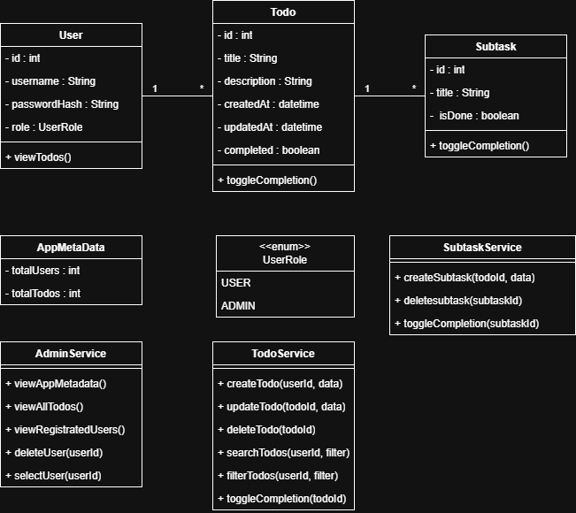

# Todo Application with Subtasks

A full-stack web application for managing tasks with hierarchical subtask support, user authentication, and role-based access control. Built with Spring Boot, React, and MySQL.


---

## Vision

The aim of this Todo task manager is to give the user an easy and efficient tool to handle all day-to-day tasks in an organized manner. Boosting the productivity levels of the user is one of our core goals, as it is achieved by splitting large and complicated tasks into smaller ones, which are much easier to handle.

Our goal is to develop an interactive interface coupled with efficient back-end functionality to provide a streamlined experience for the users. Users can try the application as guests with temporary data, or register for full features including persistent data storage, subtasks, search, and filtering functionality. Administrators have access to advanced system-level management including user management and application analytics.

---

## Use Case Diagram

The following diagram illustrates all the interactions users can have with the Todo application:


### Actors

#### User (Guest):

- Basic todo operations without authentication
- Temporary data storage (session-based, non-persistent)
- Full CRUD operations on todos
- Try the application before registering

#### Registered User:

- All User capabilities with persistent data storage
- Subtask management
- Search and filter functionality
- Secure, personal todo lists
- Access from any device

#### Admin:

- Full system access including user management
- View all todos across all users
- Delete users and access application data
- Application statistics and analytics
- Recent activity monitoring

### Use Cases by Actor

#### User Use Cases

- **View Todos** - Browse all available todos (guest: in-memory only)
- **Create Todo** - Add new todos with title, description, and due date
- **Update Todo** - Modify existing todo information
- **Delete Todo** - Remove todos with confirmation dialog
- **Guest Mode** - Use app without registration (data not saved)

#### Registered User Use Cases

- All User use cases, plus:
- **User Registration** - Create account with username, email, and password
- **User Login** - Authenticate with JWT token-based security
- **Persistent Storage** - All todos saved to database
- **View Todo Subtasks** - Display checklist items for a todo
- **Create Todo Subtask** - Add subtask items to break down tasks
- **Toggle Completion** - Mark subtasks as complete/incomplete
- **Delete Todo Subtask** - Remove individual subtasks with confirmation
- **Search Todos** - Find todos by keywords
- **Filter Todos** - Filter by status, date, or other criteria

#### Admin Use Cases

- **View Registered Users** - List all users in the system with statistics
- **Delete User** - Remove user accounts (cascades to their todos)
- **View All Todos** - Access todos from all users
- **View Todos by User** - Browse todos filtered by specific user
- **View App Data** - Access comprehensive system statistics:
    - Total users, regular users, admin count
    - Total todos, completed vs pending
    - Completion rates and averages
    - Subtask statistics
- **Recent Activity** - Monitor latest todo creation across all users
- **Admin Todo Management** - Delete any todo regardless of ownership

### Implementation Status

#### ✅ Currently Implemented:

- Todo CRUD operations (Create, Read, Update, Delete)
- Subtask management (Create, View, Toggle, Delete)
- Confirm deletion dialogs
- **User authentication and registration (JWT-based)**
- **Admin role and user management**
- **Multi-user todo segregation**
- **Role-based access control (USER/ADMIN)**
- **Application analytics dashboard**
- **Guest mode with temporary storage**
- **Secure API endpoints with authentication**

#### 🚧 Planned Features:

- Search functionality (UI implementation)
- Filter functionality (UI implementation)

---

## Class Diagram



### Class Diagram Description

The Domain Class Diagram represents the core business model of the Todo Application. It focuses only on the essential entities, their attributes, and the relationships between them, without involving controllers, services, repositories, or technical implementation details.

At the center of the domain are three main entities:

#### User

A user of the system.
Each user owns a personal collection of todos and has an assigned Role (USER or ADMIN).
Users authenticate into the system and manage their tasks.

#### Todo

A task created by a user.
Each todo contains a title, description, completion status, timestamps, and a list of its subtasks.
Todos belong to exactly one user, forming a one-to-many relationship.

#### Subtask

A smaller, actionable item that belongs to a todo.
Each subtask has its own title and completion flag and is always associated with exactly one parent todo.

#### Relationships

- User 1 → * Todo
  (A user can create and own many todos.)

- Todo 1 → * Subtask
(Each todo can have multiple subtasks.)

- User → Role (enum)
(A user is assigned exactly one role.)
---

## Features

### Authentication & Authorization
- **JWT Token-Based Authentication** - Secure, stateless authentication
- **User Registration & Login** - Create accounts with encrypted passwords
- **Role-Based Access Control** - USER and ADMIN roles with different permissions
- **Todo Ownership** - Users can only access and modify their own todos
- **Multi-User Support** - Each user has isolated, personal todo lists
- **Guest Mode** - Try the app without registration (non-persistent data)

### Core Todo Management
- **Create** todos with title, description, due date, and completion status
- **Read** all todos (user's own) or individual todo details
- **Update** existing todos with modified information
- **Delete** todos that are no longer needed
- Visual status indicators (completed/pending)
- Due date tracking with formatted display
- Automatic timestamp tracking (created_at, updated_at)

### Subtasks/Checklist System
- Add unlimited subtasks to any todo
- Check/uncheck individual subtasks
- Visual progress bar showing completion percentage
- Expand/collapse subtask lists
- Delete individual subtasks
- Automatic progress calculation (e.g., "3/5 completed - 60%")
- User ownership validation for subtasks

### Admin Features
- **User Management** - View all registered users with statistics
- **User Deletion** - Remove user accounts (with cascade delete)
- **Application Statistics**:
    - User counts (total, regular users, admins)
    - Todo statistics (total, completed, pending, completion rate)
    - Subtask statistics
    - Average todos per user
- **View All Todos** - Access todos from all users
- **User-Specific Todos** - Filter todos by specific user
- **Recent Activity** - Monitor latest todo creation
- **Admin Todo Management** - Delete any todo

### Technical Features
- RESTful API architecture
- JWT-based stateless authentication
- BCrypt password encryption
- Spring Security integration
- Persistent data storage with MySQL
- Responsive UI design (mobile & desktop)
- CORS-enabled backend for frontend communication
- Foreign key relationships with cascading deletes
- Guest mode with session storage
- Role-based endpoint protection

---

## Architecture

```
┌─────────────────┐         ┌─────────────────┐         ┌─────────────────┐
│  React Frontend │ ◄─────► │ Spring Boot API │ ◄─────► │ MySQL Database  │
│   (Port 5173)   │  HTTP   │   (Port 8080)   │  JDBC   │   (Port 3306)   │
│                 │  +JWT   │  + Security     │         │                 │
└─────────────────┘         └─────────────────┘         └─────────────────┘
```

### Technology Stack

**Backend:**
- Java 21
- Spring Boot 3.5.6
- Spring Security 6.1.5
- Spring Data JPA
- JWT (JSON Web Tokens) 0.12.3
- BCrypt Password Encryption
- MySQL Connector
- Maven

**Frontend:**
- React 18.2.0
- Vite (Build Tool)
- Axios (HTTP client)
- Modern CSS with Flexbox/Grid
- Responsive design
- JWT Token Management

**Database:**
- MySQL 8.0
- Three tables: `users`, `todos`, `subtasks`
- Foreign key relationships with cascading deletes

**Security:**
- JWT-based authentication
- Role-based authorization (USER, ADMIN)
- Password hashing with BCrypt
- Protected API endpoints
- CORS configuration

---

## Project Structure

```
Todo/
├── backend/
│   ├── src/main/java/com/todo/
│   │   ├── TodoApplication.java                # Main Spring Boot class
│   │   ├── controller/
│   │   │   ├── AuthController.java             # Authentication endpoints
│   │   │   ├── UserController.java             # User management endpoints
│   │   │   ├── AdminController.java            # Admin-only endpoints
│   │   │   ├── TodoController.java             # REST endpoints for todos
│   │   │   └── SubtaskController.java          # REST endpoints for subtasks
│   │   ├── dto/
│   │   │   ├── LoginRequest.java               # Login request DTO
│   │   │   ├── RegisterRequest.java            # Registration request DTO
│   │   │   ├── AuthResponse.java               # Auth response with JWT
│   │   │   └── UserDTO.java                    # User data transfer object
│   │   ├── entity/
│   │   │   ├── User.java                       # User entity model
│   │   │   ├── Role.java                       # Role enum (USER, ADMIN)
│   │   │   ├── Todo.java                       # Todo entity model
│   │   │   └── Subtask.java                    # Subtask entity model
│   │   ├── repository/
│   │   │   ├── UserRepository.java             # User database access
│   │   │   ├── TodoRepository.java             # Todo database access
│   │   │   └── SubtaskRepository.java          # Subtask database access
│   │   ├── security/
│   │   │   ├── SecurityConfig.java             # Spring Security configuration
│   │   │   ├── JwtUtil.java                    # JWT token utilities
│   │   │   ├── JwtAuthenticationFilter.java    # JWT filter
│   │   │   └── CustomUserDetailsService.java   # User authentication
│   │   └── service/
│   │       ├── AuthService.java                # Authentication business logic
│   │       ├── UserService.java                # User management logic
│   │       ├── TodoService.java                # Todo business logic
│   │       └── SubtaskService.java             # Subtask business logic
│   ├── src/main/resources/
│   │   └── application.properties              # Database & JWT config
│   └── pom.xml                                 # Maven dependencies
│
├── frontend/
│   ├── src/
│   │   ├── components/
│   │   │   ├── AdminDashboard.css              # Admin dashboard styling
│   │   │   ├── AdminDashboard.jsx              # Admin dashboard component
│   │   │   ├── AuthModal.css                   # Authentication styling
│   │   │   ├── AuthModal.jsx                   # Authentication component
│   │   │   ├── GuestWarning.css                # Guest warning banner styling
│   │   │   ├── GuestWarning.jsx                # Guest warning banner component
│   │   │   ├── Navbar.css                      # Navbar styling
│   │   │   └── Navbar.jsx                      # Navbar component
│   │   ├── services/
│   │   │   └── authService.js                  # Authentication API calls
│   │   ├── context/
│   │   │   └── authContext.jsx                 # Authentication context
│   │   ├── App.jsx                             # Main React component
│   │   ├── App.css                             # Application styles
│   │   ├── index.css                           # Index styles
│   │   └── main.jsx                            # React entry point
│   ├── public/
│   │   └── index.html                          # HTML template
│   └── package.json                            # Node.js dependencies
│
├── database/
│   ├── database-setup.sql                # Initial database setup
│   ├── database-users.sql                # Users table setup
│   └── database-subtasks.sql             # Subtasks table setup
│
├── docs/
│   ├── DetailedUseCaseDescriptions.docx
│   └── DPU.png                           # Use case diagram
│
├── .gitattributes                        # Git settings for file handling
├── .gitignore                            # List of files ignored by Git
└── README.md                             # This file
```

---

## Getting Started

### Prerequisites

- **Java 21** or higher
- **Maven 3.8+**
- **Node.js 16+** and npm
- **MySQL 8.0+** server
- **Git** (optional)

### Installation

#### 1. Clone the Repository

```bash
git clone https://github.com/yourusername/todo-app.git
cd todo-app
```

#### 2. Set Up MySQL Database

```bash
# Login to MySQL
mysql -u root -p

# Run database setup scripts
source database/database-setup.sql
source database/database-users.sql
source database/database-subtasks.sql

# Verify tables were created
USE todo_db;
SHOW TABLES;
# Should show: users, todos, subtasks
```

#### 3. Configure Backend

Update `backend/src/main/resources/application.properties`:

```properties
# Database Configuration
spring.datasource.url=jdbc:mysql://localhost:3306/todo_db
spring.datasource.username=root
spring.datasource.password=YOUR_MYSQL_PASSWORD

# JWT Configuration
jwt.expiration=86400000
```

**Generate Password Hashes for Test Users:**

Run this Java code to generate BCrypt hashes:

```java
import org.springframework.security.crypto.bcrypt.BCryptPasswordEncoder;

public class PasswordGenerator {
    public static void main(String[] args) {
        BCryptPasswordEncoder encoder = new BCryptPasswordEncoder();
        System.out.println("admin123: " + encoder.encode("admin123"));
        System.out.println("user123: " + encoder.encode("user123"));
    }
}
```

Use the generated hashes in your SQL insert statements for test users.

#### 4. Run Backend (Spring Boot)

```bash
cd backend
mvn clean install
mvn spring-boot:run
```

Backend will start on `http://localhost:8080`

#### 5. Run Frontend (React + Vite)

```bash
cd frontend
npm install
npm run dev
```

Frontend will open at `http://localhost:5173`

---

## User Roles & Permissions

### Guest User (Unauthenticated)
**Access Level:** Limited, temporary data only

**Permissions:**
- ✅ Create todos (stored in sessionStorage)
- ✅ View todos (own session only)
- ✅ Update todos (session only)
- ✅ Delete todos (session only)
- ❌ No subtask support
- ❌ No data persistence
- ❌ Data lost on page refresh/close

**Use Case:** Try the application before registering

---

### Registered User (USER Role)
**Access Level:** Full personal task management

**Permissions:**
- ✅ All guest permissions with database persistence
- ✅ Create/view/update/delete own todos
- ✅ Create/manage subtasks for own todos
- ✅ View progress bars and statistics
- ✅ Access from any device
- ✅ Search and filter (when implemented)
- ❌ Cannot view other users' todos
- ❌ Cannot access admin features

**Endpoints:**
- `POST /api/auth/register` - Create account
- `POST /api/auth/login` - Get JWT token
- `GET /api/users/me` - View own profile
- `GET /api/todos` - View own todos
- `POST /api/todos` - Create todo
- `PUT /api/todos/{id}` - Update own todo
- `DELETE /api/todos/{id}` - Delete own todo
- All subtask endpoints (for own todos)

---

### Admin (ADMIN Role)
**Access Level:** Full system access

**Permissions:**
- ✅ All registered user permissions
- ✅ View all registered users
- ✅ Delete any user account
- ✅ View all todos from all users
- ✅ View todos by specific user
- ✅ Delete any todo (regardless of owner)
- ✅ Access application statistics:
    - User counts and analytics
    - Todo statistics and completion rates
    - Subtask statistics
    - Recent activity monitoring
- ✅ System-wide data management

**Admin Endpoints:**
- `GET /api/users` - View all users
- `GET /api/users/{id}` - View user details
- `DELETE /api/users/{id}` - Delete user
- `GET /api/admin/todos` - View all todos
- `GET /api/admin/todos/user/{userId}` - Todos by user
- `GET /api/admin/stats` - Application statistics
- `GET /api/admin/activity/recent` - Recent activity
- `DELETE /api/admin/todos/{id}` - Delete any todo

---

## API Endpoints

### Authentication Endpoints (Public)

| Method | Endpoint | Description | Auth Required |
|--------|----------|-------------|---------------|
| POST | `/api/auth/register` | Register new user | No |
| POST | `/api/auth/login` | Login and get JWT token | No |
| GET | `/api/auth/validate` | Validate JWT token | Yes |

### User Endpoints

| Method | Endpoint | Description | Auth Required | Role Required |
|--------|----------|-------------|---------------|---------------|
| GET | `/api/users/me` | Get current user info | Yes | USER/ADMIN |
| GET | `/api/users` | Get all users | Yes | ADMIN |
| GET | `/api/users/{id}` | Get user by ID | Yes | ADMIN |
| DELETE | `/api/users/{id}` | Delete user | Yes | ADMIN |

### Todo Endpoints

| Method | Endpoint | Description | Auth Required | Notes |
|--------|----------|-------------|---------------|-------|
| GET | `/api/todos` | Get user's todos | Optional | Empty for guests, user's todos when authenticated |
| GET | `/api/todos/{id}` | Get single todo | Optional | Only if owned by user |
| POST | `/api/todos` | Create new todo | Optional | Temp for guests, persistent for users |
| PUT | `/api/todos/{id}` | Update todo | Optional | Only if owned by user |
| DELETE | `/api/todos/{id}` | Delete todo | Optional | Only if owned by user |

### Subtask Endpoints

| Method | Endpoint | Description | Auth Required | Notes |
|--------|----------|-------------|---------------|-------|
| GET | `/api/subtasks/todo/{todoId}` | Get subtasks for todo | Optional | Only if parent todo is owned |
| GET | `/api/subtasks/{id}` | Get single subtask | Optional | Only if parent todo is owned |
| POST | `/api/subtasks` | Create subtask | Optional | Only if parent todo is owned |
| PUT | `/api/subtasks/{id}` | Update subtask | Optional | Only if parent todo is owned |
| DELETE | `/api/subtasks/{id}` | Delete subtask | Optional | Only if parent todo is owned |
| GET | `/api/subtasks/todo/{todoId}/stats` | Get completion stats | Optional | Only if parent todo is owned |

### Admin Endpoints

| Method | Endpoint | Description | Auth Required | Role Required |
|--------|----------|-------------|---------------|---------------|
| GET | `/api/admin/todos` | Get all todos | Yes | ADMIN |
| GET | `/api/admin/todos/user/{userId}` | Get todos by user | Yes | ADMIN |
| GET | `/api/admin/stats` | Get app statistics | Yes | ADMIN |
| GET | `/api/admin/activity/recent` | Get recent activity | Yes | ADMIN |
| DELETE | `/api/admin/todos/{id}` | Delete any todo | Yes | ADMIN |

---

## Authentication Flow

### Registration

```bash
curl -X POST http://localhost:8080/api/auth/register \
  -H "Content-Type: application/json" \
  -d '{
    "username": "newuser",
    "email": "user@example.com",
    "password": "securepassword123"
  }'
```

**Response:**
```json
{
  "token": "eyJhbGciOiJIUzI1NiIsInR5cCI6IkpXVCJ9...",
  "username": "newuser",
  "email": "user@example.com",
  "role": "USER"
}
```

### Login

```bash
curl -X POST http://localhost:8080/api/auth/login \
  -H "Content-Type: application/json" \
  -d '{
    "username": "admin",
    "password": "admin123"
  }'
```

**Response:**
```json
{
  "token": "eyJhbGciOiJIUzI1NiIsInR5cCI6IkpXVCJ9...",
  "username": "admin",
  "email": "admin@todo.com",
  "role": "ADMIN"
}
```

### Using JWT Token

```bash
# Store token
TOKEN="eyJhbGciOiJIUzI1NiIsInR5cCI6IkpXVCJ9..."

# Use token in requests
curl -X GET http://localhost:8080/api/todos \
  -H "Authorization: Bearer $TOKEN"
```

---

## Example API Requests

### Create a Todo (Authenticated)

```bash
curl -X POST http://localhost:8080/api/todos \
  -H "Content-Type: application/json" \
  -H "Authorization: Bearer YOUR_JWT_TOKEN" \
  -d '{
    "title": "Complete project",
    "description": "Finish the Todo app",
    "isCompleted": false,
    "dueDate": "2025-11-15T17:00:00"
  }'
```

### Add a Subtask

```bash
curl -X POST http://localhost:8080/api/subtasks \
  -H "Content-Type: application/json" \
  -H "Authorization: Bearer YOUR_JWT_TOKEN" \
  -d '{
    "todoId": 1,
    "title": "Write documentation",
    "isCompleted": false,
    "position": 0
  }'
```

### Admin: View All Users

```bash
curl -X GET http://localhost:8080/api/users \
  -H "Authorization: Bearer ADMIN_JWT_TOKEN"
```

### Admin: View Application Statistics

```bash
curl -X GET http://localhost:8080/api/admin/stats \
  -H "Authorization: Bearer ADMIN_JWT_TOKEN"
```

**Response:**
```json
{
  "totalUsers": 15,
  "regularUsers": 13,
  "adminUsers": 2,
  "totalTodos": 47,
  "completedTodos": 23,
  "pendingTodos": 24,
  "completionRate": 48.94,
  "totalSubtasks": 156,
  "completedSubtasks": 89,
  "pendingSubtasks": 67,
  "avgTodosPerUser": 3.13
}
```

---

## Database Schema

### `users` Table

| Column | Type | Description |
|--------|------|-------------|
| id | INT (PK, AI) | Unique identifier |
| username | VARCHAR(50) UNIQUE | Username for login |
| email | VARCHAR(100) UNIQUE | User email address |
| password | VARCHAR(255) | BCrypt hashed password |
| role | ENUM('USER', 'ADMIN') | User role |
| is_active | BOOLEAN | Account status |
| created_at | TIMESTAMP | Registration timestamp |
| updated_at | TIMESTAMP | Last update timestamp |

### `todos` Table

| Column | Type | Description |
|--------|------|-------------|
| id | INT (PK, AI) | Unique identifier |
| title | VARCHAR(255) | Todo title |
| description | TEXT | Detailed description |
| is_completed | BOOLEAN | Completion status |
| due_date | DATETIME | Deadline |
| user_id | INT (FK) | Owner user ID |
| created_at | TIMESTAMP | Creation timestamp |
| updated_at | TIMESTAMP | Last update timestamp |

### `subtasks` Table

| Column | Type | Description |
|--------|------|-------------|
| id | INT (PK, AI) | Unique identifier |
| todo_id | INT (FK) | Parent todo ID |
| title | VARCHAR(255) | Subtask title |
| is_completed | BOOLEAN | Completion status |
| position | INT | Display order |
| created_at | TIMESTAMP | Creation timestamp |

### Relationships

- **User → Todos**: One-to-Many (One user has many todos)
    - `ON DELETE CASCADE` - Deleting user deletes all their todos
- **Todo → Subtasks**: One-to-Many (One todo has many subtasks)
    - `ON DELETE CASCADE` - Deleting todo deletes all its subtasks

---

## Testing

### Manual Testing Checklist

#### Authentication
- [ ] Register a new user
- [ ] Login with correct credentials
- [ ] Login with incorrect credentials (should fail)
- [ ] Access protected endpoint without token (should fail)
- [ ] Access protected endpoint with valid token (should succeed)
- [ ] Access admin endpoint as regular user (should fail)

#### Guest Mode
- [ ] Create todo without login
- [ ] View todos without login
- [ ] Update todo without login
- [ ] Delete todo without login
- [ ] Refresh page (data should be lost)

#### User Todo Operations
- [ ] Create todo as authenticated user
- [ ] View own todos
- [ ] Update own todo
- [ ] Delete own todo
- [ ] Try to access another user's todo (should fail)

#### Subtask Operations
- [ ] Add subtask to own todo
- [ ] Check/uncheck subtask
- [ ] Delete subtask
- [ ] Verify progress bar updates
- [ ] Try to add subtask to another user's todo (should fail)

#### Admin Operations
- [ ] Login as admin
- [ ] View all users
- [ ] View user details
- [ ] Delete a user
- [ ] View all todos
- [ ] View todos by specific user
- [ ] View application statistics
- [ ] Delete any user's todo

#### Backend API Testing

```bash
# Register user
curl -X POST http://localhost:8080/api/auth/register \
  -H "Content-Type: application/json" \
  -d '{"username":"testuser","email":"test@test.com","password":"test123"}'

# Login
curl -X POST http://localhost:8080/api/auth/login \
  -H "Content-Type: application/json" \
  -d '{"username":"testuser","password":"test123"}'

# Get todos (with token)
curl -X GET http://localhost:8080/api/todos \
  -H "Authorization: Bearer YOUR_TOKEN_HERE"

# Admin: Get all users
curl -X GET http://localhost:8080/api/users \
  -H "Authorization: Bearer ADMIN_TOKEN_HERE"

# Admin: Get stats
curl -X GET http://localhost:8080/api/admin/stats \
  -H "Authorization: Bearer ADMIN_TOKEN_HERE"
```

---

## Security Features

### Password Security
- ✅ BCrypt password hashing (10 rounds)
- ✅ Passwords never stored in plain text
- ✅ Secure password validation

### JWT Token Security
- ✅ HS256 algorithm
- ✅ 24-hour token expiration
- ✅ Stateless authentication
- ✅ Secure token generation with secret key

### API Security
- ✅ Role-based access control
- ✅ Endpoint protection with Spring Security
- ✅ CORS configuration
- ✅ Input validation
- ✅ SQL injection prevention (JPA)

### Data Security
- ✅ User data isolation
- ✅ Ownership verification on all operations
- ✅ Cascading deletes for data integrity
- ✅ Foreign key constraints

---

## Development

### Running in Development Mode

**Backend (with auto-reload):**
```bash
cd backend
mvn spring-boot:run
```

**Frontend (with hot reload):**
```bash
cd frontend
npm run dev
```

### Building for Production

**Backend:**
```bash
mvn clean package
java -jar target/Todo-0.0.1-SNAPSHOT.jar
```

**Frontend:**
```bash
npm run build
# Serve the dist folder with a web server
```

---

## Troubleshooting

### Backend won't start

**Problem:** `Failed to configure datasource`

**Solution:**
- Verify MySQL is running: `mysql -u root -p`
- Check `application.properties` has correct credentials
- Ensure `todo_db` database exists with all tables

---

### Authentication fails

**Problem:** `401 Unauthorized` or `Invalid token`

**Solution:**
- Verify JWT token is included in Authorization header
- Check token hasn't expired (24 hour default)
- Ensure token format is: `Bearer YOUR_TOKEN_HERE`
- Try logging in again to get a fresh token

---

### Cannot create user

**Problem:** `Username already exists` or `Email already exists`

**Solution:**
- Choose a different username
- Use a different email address
- Check database for existing users: `SELECT * FROM users;`

---

### Guest mode not working

**Problem:** Guest todos not saving or loading

**Solution:**
- Check browser sessionStorage is enabled
- Clear sessionStorage: `sessionStorage.clear()`
- Verify backend allows public access to `/api/todos`
- Check browser console for errors

---

### CORS errors

**Problem:** `Access to XMLHttpRequest has been blocked by CORS policy`

**Solution:**
- Verify `@CrossOrigin` annotations in controllers
- Check `SecurityConfig` CORS configuration
- Ensure frontend URL is in allowed origins (port 5173 for Vite)

---

## Glossary

| Term | Definition | Why It Matters |
|------|------------|----------------|
| **Todo** | A user-created task with a title, description, status, and optional due date. | Core object of the system; everything revolves around creating and managing Todos. |
| **Subtask** | A smaller actionable item linked to a Todo. | Enables users to break down complex tasks and track detailed progress. |
| **JWT (JSON Web Token)** | A compact, URL-safe token used for authentication. | Enables stateless authentication without server-side sessions. |
| **BCrypt** | A password hashing function used to securely store passwords. | Protects user passwords from being stored in plain text. |
| **Guest User** | An unauthenticated user using the app with temporary data. | Allows users to try the app before registering. |
| **Registered User** | A user with an account and persistent data storage. | Unlocks full functionality and data persistence across sessions. |
| **Admin** | A privileged user role with full access to system data and user management. | Ensures system maintenance, cleanup, and administrative oversight. |
| **Role-Based Access Control (RBAC)** | Security approach that restricts system access based on user roles. | Ensures users can only access features and data appropriate to their role. |
| **Completion Status** | Indicates whether a Todo or Subtask is finished (`true`/`false`). | Used in progress tracking, UI indicators, and filtering features. |
| **Progress Bar** | A visual indicator showing the percentage of completed subtasks within a Todo. | Helps users quickly assess progress on larger tasks. |
| **Due Date** | An optional timestamp representing the deadline for a Todo. | Supports sorting, prioritization, and future reminders. |
| **CRUD** | Create, Read, Update, Delete operations performed on Todos and Subtasks. | Describes the fundamental backend and frontend interactions within the application. |
| **Cascade Delete** | Automatically deleting related records when a parent record is deleted. | Ensures data integrity (e.g., deleting a user deletes all their todos). |

---

## Contributing

We welcome contributions from all team members! Please follow the guidelines below to ensure a consistent and collaborative workflow.

### Development Workflow (Trunk-Based Development)

This project uses Trunk-Based Development, meaning:
- All developers commit directly to the main branch
- Small, frequent commits are encouraged
- Feature branches may be used temporarily, but must be short-lived and merged quickly
- Changes should be pushed often to avoid long-running branches and merge conflicts

### Coding Standards

To keep code consistent and easy to read, contributors must follow the standard coding conventions of the language or framework they work in:

#### React Frontend

- Follow official React style guidelines and best practices
- Use modern ES6+ JavaScript and clean TypeScript patterns
- Follow commonly accepted React conventions such as:
    - Component-based structure
    - PascalCase for components
    - camelCase for functions and variables
    - Meaningful naming
    - Avoiding unnecessary re-renders
- Follow project Prettier/ESLint rules (if present)
- Store JWT tokens securely (localStorage for persistence, sessionStorage for guests)
- Use axios interceptors for authentication headers

#### Spring Boot Backend

- Follow standard Java conventions (Oracle Java Style Guide)
- Follow Spring Boot best practices:
    - Layered architecture (Controller → Service → Repository)
    - Clear naming: *Controller, *Service, *Repository
    - Use dependency injection instead of manual instantiation
    - Consistent formatting, JPA naming conventions, and REST API conventions
- Security best practices:
    - Never log passwords or tokens
    - Use DTOs to avoid exposing sensitive entity fields
    - Validate all user inputs
    - Use @PreAuthorize for role-based access control

### How to Contribute

- Pull the latest changes from main
- Make your changes in small, focused commits
- Write clear commit messages
- Push directly to main (or create a short-lived feature branch if necessary)
- Open a Pull Request only for larger changes that need review

---

## Authors

- **JovanObr** - [GitHub Profile](https://github.com/JovanObr)
- **ad-a-dglgmut** - [GitHub Profile](https://github.com/ad-a-dglgmut)
- **DraganS005** - [GitHub Profile](https://github.com/DraganS005)

---

## Acknowledgments

- Spring Boot documentation
- Spring Security documentation
- JWT.io for JWT resources
- React documentation
- MySQL documentation
- Stack Overflow community
- Vite documentation

---

## Support

If you have any questions or issues:

- Open an issue on GitHub
- Email: jovan.obrenovic@student.um.si

---

## Project Status

**Current Version:** 1.0.2

**Status:** ✅ Stable - Production Ready with Authentication

**Last Updated:** November 2025

---

## Changelog

### Version 1.0.2 (Current)
- ✅ Added JWT-based authentication
- ✅ User registration and login
- ✅ Role-based access control (USER/ADMIN)
- ✅ Admin dashboard with statistics
- ✅ User management (admin only)
- ✅ Multi-user support with data isolation
- ✅ Guest mode with temporary storage
- ✅ Updated all controllers with authentication
- ✅ Password encryption with BCrypt
- ✅ Security configuration with Spring Security

### Version 1.0.1
- ✅ Subtask functionality
- ✅ Progress tracking
- ✅ Basic CRUD operations
- ✅ MySQL integration

### Version 1.0.0
- ✅ Initial release
- ✅ Basic todo management

---

## Useful Links

- [Spring Boot Documentation](https://spring.io/projects/spring-boot)
- [Spring Security Documentation](https://spring.io/projects/spring-security)
- [JWT Introduction](https://jwt.io/introduction)
- [React Documentation](https://react.dev/)
- [Vite Documentation](https://vitejs.dev/)
- [MySQL Documentation](https://dev.mysql.com/doc/)
- [REST API Best Practices](https://restfulapi.net/)
- [BCrypt Online](https://bcrypt-generator.com/)

---
